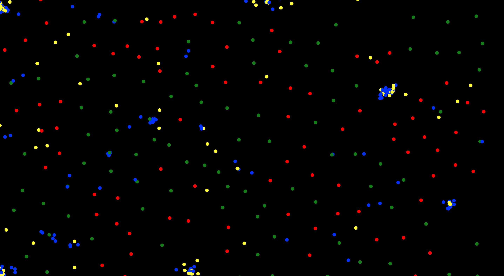

# p5-particle-life

Implementing particle life in processing to understand it better and potentially create some novel results.

Inspiration from many amazing projects such as:

https://github.com/tom-mohr/particle-life

https://www.brainxyz.com/machine-learning/artificial-life/

## Current results

## Development

Super easy and fast dev using `parcel` with `typescript` and `p5`.

1. Clone the repo
2. Run `npm i`
3. Run `npm start`
